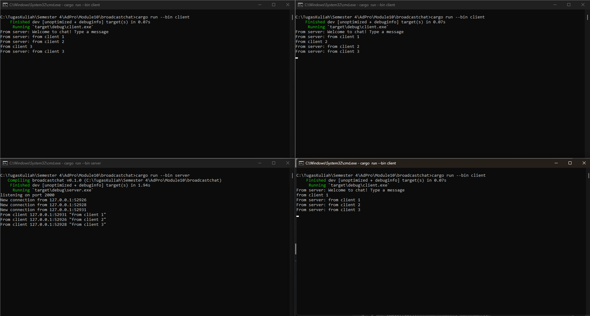

## 2.1. Original code of broadcast chat.

  
Berdasarkan lampiran gambar diatas, terlihat bahwa masing-masing dari ketiga client tersebut mengirim pesan. Pada gambar tersebut juga terlihat bahwa server akan menerima pesan dari masing-masing client dan mengirimnya kembali ke semua client. Langkah-langkah yang saya lakukan untuk menjalankan program tersebut seperti pada gambar adalah membuka 4 terminal. Lalu untuk 3 terminal melakukan command `cargo run --bin client` untuk membuat 3 client dan untuk 1 terminal melakukan command `cargo run --bin server` untuk menjadi server. Nantinya, terminal yang berperan sebagai client bisa dilakukan pengetikan pesan untuk kemudian dikirimkan.  