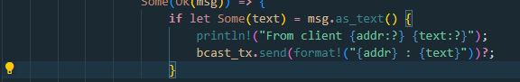

## 2.1. Original code of broadcast chat.

  
Berdasarkan lampiran gambar diatas, terlihat bahwa masing-masing dari ketiga client tersebut mengirim pesan. Pada gambar tersebut juga terlihat bahwa server akan menerima pesan dari masing-masing client dan mengirimnya kembali ke semua client. Langkah-langkah yang saya lakukan untuk menjalankan program tersebut seperti pada gambar adalah membuka 4 terminal. Lalu untuk 3 terminal melakukan command `cargo run --bin client` untuk membuat 3 client dan untuk 1 terminal melakukan command `cargo run --bin server` untuk menjadi server. Nantinya, terminal yang berperan sebagai client bisa dilakukan pengetikan pesan untuk kemudian dikirimkan.  

## 2.2. Modifying the websocket port

Berikut perubahan yang saya lakukan pada `src/bin/server.rs`  
  

Berikut perubahan yang saya lakukan pada `src/bin/client.rs`  
  

Berdasarkan kode pada `src/bin/server.rs` dan `src/bin/client.rs` dapat terlihat menggunakan protokol WebSocket yang sama, yang dikelola oleh library `tokio_websockets`. Dengan ini, dipastikan bahwa agar kedua sisi yaitu baik client maupun server dapat berkomunikasi dengan protokol yang konsisten dan terdefinisi dengan baik.  

Lalu dapat terlihat juga pada foto dibawah ini bahwa program masih berjalan dengan baik walaupun port yang digunakan sudah dirubah.  
  

## 2.3. Small changes. Add some information to client

Berikut hasil setelah dilakukan perubahan pada output  
  

Berikut modifikasi yang saya lakukan:  
  
  
  

Beberapa perubahan diatas yang saya lakukan untuk memberikan broadcast *addr* yang berisi addres dari mana pesan dikirim. Lalu, saya juga menambahkan asal dari komputer Rafli untuk beberapa pesan.  

